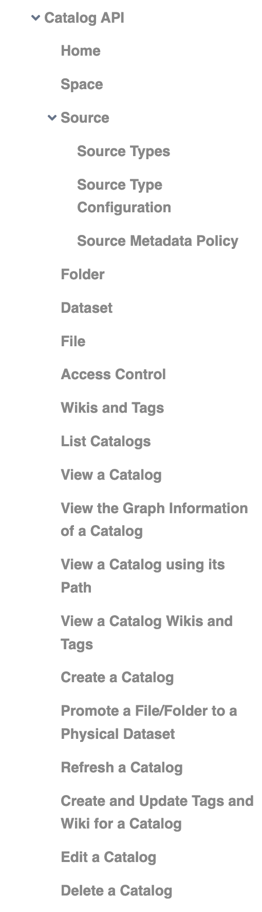
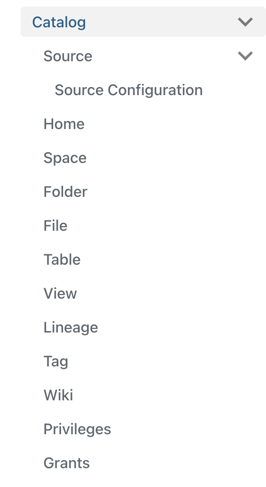

[Dremio](https://www.dremio.com/) is an open data lakehouse that allows users to access and manipulate data directly from data lake storage without copying data into expensive proprietary systems. At Dremio, I write and edit the API documentation as well as docs in the security realm, from authentication and authorization to secrets and encryption.

## Work examples

Dremio's documentation is published at [https://docs.dremio.com/](https://docs.dremio.com/). Here are some examples that demonstrate my work:

* API documentation:
	* [API Reference overview page](https://docs.dremio.com/current/reference/api/)
	* Catalog [Source](https://docs.dremio.com/current/reference/api/catalog/source/)
	* [Job](https://docs.dremio.com/current/reference/api/job/) and [Job Results](https://docs.dremio.com/current/reference/api/job/job-results)
	* [User](https://docs.dremio.com/current/reference/api/user/), [User Privileges](https://docs.dremio.com/current/reference/api/user/privilege), and [User Tokens](https://docs.dremio.com/current/reference/api/user/token)
* User guides:
	* [Configure Okta as an Identity Provider](https://docs.dremio.com/cloud/security/authentication/idp/okta)
	* [Configure SCIM Provisioning with Okta](https://docs.dremio.com/cloud/security/authentication/scim/scim-okta)

## API documentation project

When I started working at Dremio, the API documentation for the Software product was incomplete and followed a different presentation than the docs for the Cloud product. The docs for the Software API docs were also organized in a confusing way, with some pages describing API schemas and others describing endpoints.

I completed the documentation for the 10 Software APIs, moving the content into the correct format as I worked. I also reorganized the Software API docs so that all endpoints for each object are listed on a single page.

Here's a rough idea of how I approached the work:

1. Listed each existing page of the API docs in a spreadsheet.
2. Reviewed the content in the existing docs and created a list of every documented endpoint.
3. Grouped the endpoints by their request URLs and mapped all of the existing content to the correct group.
4. Worked through each group of endpoints to update and complete the documentation, using Postman and cURL to test endpoints and confirm request bodies and responses. I moved the existing content into the Cloud product format and filled in missing attributes, parameters, and endpoints based on my testing and discussions with subject matter experts.
5. Consulted with Dremio's engineers and product managers to follow up on gaps I couldn't resolve myself.

Here are a few before-and-after examples to demonstrate my work:

|      |        |       |
| ---- | ------ | ----- |
| API Reference overview page | [Before](software-api-index-old.pdf) | [After](https://docs.dremio.com/current/reference/api/) |
| Catalog Source | [Before](catalog-source-old.pdf) | [After](https://docs.dremio.com/current/reference/api/catalog/source/) |
| Catalog Datasets | [Before](catalog-dataset-old.pdf) | [After (Table)](https://docs.dremio.com/current/reference/api/catalog/table) [After (View)](https://docs.dremio.com/current/reference/api/catalog/view) |
| LDAP User Cache | [Before](ldap-api-old.pdf) | [After](https://docs.dremio.com/current/reference/api/ldap-authorization) |

And these screenshots of the left navigation menu for the Catalog API show how I organized all of the content into a logical arrangement to help users find what they are looking for:

| Former Catalog API Menu | Catalog API Menu After Reorganization |
| ------ | ------- |
|  |  |

## Tools and methods

* Docs as Code
* Docusaurus
* Git/GitHub
* Hugo
* Markdown
* Postman

